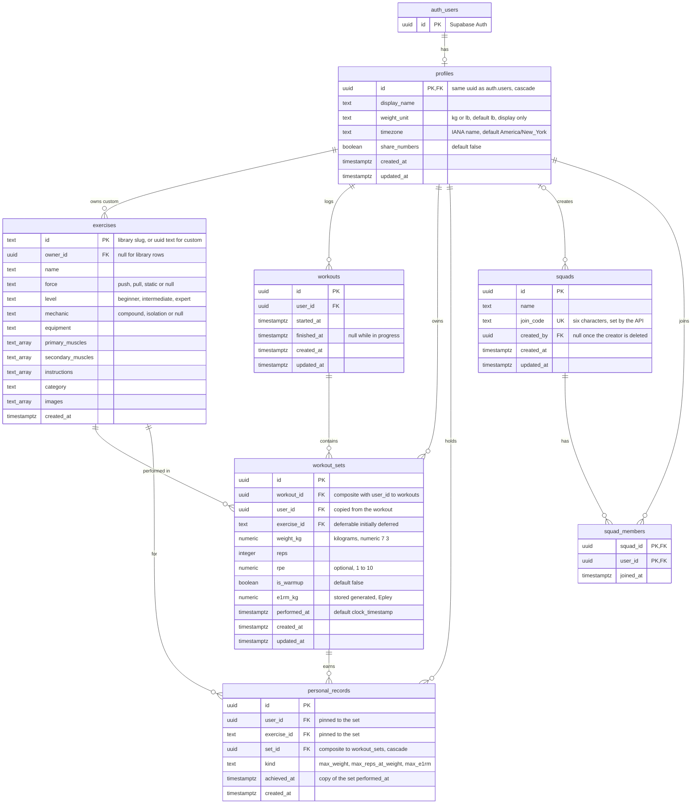

# Spotter database

This is the team guide to the Spotter schema. The whole schema is one migration, supabase/migrations/20260928120000_init.sql, which runs clean on a fresh Supabase project. Read it side by side with this page: the comments in the SQL say what each column is, this page says why it is there and shows the three queries that matter most.

Stack: PostgreSQL 17 on Supabase, with login through Supabase Auth so users live in auth.users; an Express API in TypeScript that connects to Postgres with the project connection string (pooled DATABASE_URL, transaction mode, pg or postgres driver) as the postgres role, which owns every table and so bypasses row level security; and a React web app that talks only to the Express API and never queries Postgres directly.

Shape: seven tables, one trigger function (set_updated_at), two helper functions for row level security (is_squad_member and is_squad_mate), no views, no partitioning, no other triggers. Primary keys are uuids from gen_random_uuid() except exercises.id, which is text. Every time column is timestamptz. created_at defaults to now() everywhere; updated_at exists only on profiles, workouts, workout_sets and squads, the tables whose rows get edited, and the one trigger keeps it current. Only profiles references auth.users, so deleting the auth user cascades through profiles and removes everything the person owned.

## Tables

### profiles

One row per user, keyed by the same uuid as auth.users. The API upserts the row on the first authenticated request (insert on conflict do nothing), so there is no auth trigger to maintain. display_name is what squad mates see. weight_unit (kg or lb, default lb) is only the display preference; every stored weight is kilograms. timezone is an IANA zone name that the API sets from the browser; streaks count sessions per local week, and a check constraint rejects an unknown zone name on write so a typo cannot break the streak query later. share_numbers (default false) is the privacy opt in: while it is false, squad mates can see that a record happened but never the weight or the reps.

### exercises

The seeded library and user owned custom exercises in one table. Library rows come from the public domain free exercise db JSON (seeded in a later issue) and keep its slug as the text primary key, because the seed already uses it and it reads well in URLs; their owner_id is null. A custom exercise has owner_id set and an id that defaults to a uuid rendered as text, which can never collide with a slug, so there is no second table. The array columns (primary_muscles, secondary_muscles, instructions, images) mirror the JSON; force, level and mechanic are checked against the dataset's values and category stays unchecked until the seed shows the real set. exercises_owner_idx is partial (owner_id is not null) and covers a user's custom list and the cascade from profiles. An exercise with history cannot be deleted, because workout_sets references it without cascade.

### workouts

One row per session. started_at defaults to now(); finished_at is null while the workout is in progress, and a finished workout is what streaks and the leaderboard count as a session. There is no title, no notes and no workout_exercises table: an exercise is in a workout when it has a set there. The unique constraint on (id, user_id) exists only as the target of the composite foreign key on workout_sets. workouts_user_started_idx (user_id, started_at desc) serves the history page, streaks, consistency and volume per workout.

### workout_sets

The hot table, one row per logged set. user_id is copied from the workout and kept honest by the composite foreign key (workout_id, user_id) to workouts (id, user_id), so the ghost row, the charts and the record check read one index and never join to find the owner, and the RLS policy is a single column compare. weight_kg is kilograms as numeric(7,3), zero allowed for bodyweight work; reps, the optional rpe and is_warmup are as logged. Warmup sets show in the ghost row but never count for records, charts or volume. e1rm_kg is a stored generated column, round(weight_kg * (1 + reps / 30.0), 3), so the Epley formula lives in one place and the integer division trap (30 instead of 30.0) cannot recur in copies of the query.

performed_at is when the set happened. It orders the ghost row and the charts and is the hook for offline sync, where the client sends its own value and created_at stays server time. It defaults to clock_timestamp() rather than now() so rows written in one statement still get distinct ordered values. The API sends performed_at explicitly whenever it writes more than one set in a statement.

exercise_id references exercises without cascade but deferrable initially deferred. When an account is deleted, the cascade through the user's custom exercises can reach a set before the cascade through their workouts has removed it, and a plain check would fail right there; deferred, the check runs at commit, when both are gone. The API accepts an exercise_id on a set only when the row is a library row or a custom row owned by the same user; otherwise deleting the exercise owner's account would fail on the foreign key. Custom exercise names in the feed come from the API (service role or direct connection), not from RLS.

Indexes: workout_sets_user_exercise_performed_idx (user_id, exercise_id, performed_at desc) is the ghost row, per user exercise history for the charts, the record check and leaderboard improvement, everything shaped like this user, this exercise, newest first. workout_sets_workout_exercise_idx (workout_id, exercise_id, performed_at) loads one workout, reads the ghost workout's sets for one exercise and backs the cascade from workouts. The unique constraint on (id, user_id, exercise_id) is only the target of the composite foreign key from personal_records.

### personal_records

An append only log of record events. A row means this set was a record of this kind, where kind is max_weight (heaviest weight for the exercise), max_reps_at_weight (most reps at this set's exact weight_kg) or max_e1rm (best Epley estimate). No numbers live here. The set holds them, and only the owner can read the set, so squad mates see that a record happened and nothing more unless the owner turned on share_numbers and the API joins the numbers in. user_id and exercise_id are copied from the set and pinned to it by the composite foreign key (set_id, user_id, exercise_id) to workout_sets, backed by one extra unique index on workout_sets, so a record can never name the wrong user or exercise. achieved_at copies the set's performed_at so listings and the feed sort without a join. The unique constraint on (set_id, kind) makes the API's insert idempotent on retry. Records are detected by comparing the new set against the user's earlier non warmup sets, never against old record rows, so a stale or edited record can never hide a real one, and a recompute is delete then replay. personal_records_user_exercise_kind_idx (user_id, exercise_id, kind, achieved_at desc) is record lookup per user and exercise; personal_records_user_achieved_idx (user_id, achieved_at desc) is the per user listing and the squad feed.

### squads

A squad has a name, a creator and a six character join_code that friends type in. created_by becomes null if the creator's account is deleted, so the squad survives and the API can reassign it. Codes cannot be read or set from the browser. The API generates join codes from the alphabet ABCDEFGHJKLMNPQRSTUVWXYZ23456789 (no O, 0, I or 1 confusion) and retries the insert on collision; the column default, six characters of a uuid, is only a fallback that keeps the not null constraint satisfied. squads_join_code_key is the unique index the join lookup uses.

### squad_members

The roster: one row per (squad_id, user_id) with joined_at. There are no roles; the creator of the squad is its owner and everyone else is a member. The primary key covers the roster direction and squad_members_user_idx covers a user's squads. Both RLS helpers read this table.

## Units

Every weight is stored in kilograms as numeric(7,3), and profiles.weight_unit (default lb, because most users are in the US) is the display preference the API converts to at its boundary. One canonical column keeps every comparison, aggregate and the reps at weight bucket a plain numeric expression, where a value plus unit per row would push a conversion into every query and every index. Three decimals of kg keep any pound value a person types within 0.002 lb, so a weight shown to one decimal always comes back as typed (135 lb is stored as 61.235 kg and displays as 135.0). Compare weights only as stored kg, never as converted pounds. Convert on the way in with one shared helper, round(lb * 0.45359237, 3), and round output to the nearest 0.25 lb, so two entries of the same pound value store the same weight_kg and the reps at weight bucket matches.

## Row level security

Row level security is enabled on all seven tables and every policy is written to the authenticated role. Today the policies are dormant: the Express API connects as the postgres role, which owns the tables and bypasses row level security, so the API is the gate and scopes every query by the user id from the verified JWT. The policies exist so that a future web app talking to Postgres through the supabase js client with a user JWT is correct on day one. auth.uid() is wrapped in a scalar subquery in every policy so Postgres evaluates it once per query instead of once per row.

The model, table by table:

* profiles: read yourself and your squad mates (the leaderboard needs their names); insert and update only yourself; no delete, since accounts are deleted through auth.users.
* exercises: read library rows and your own custom rows; insert, update and delete only your own custom rows. When a feed entry names someone else's custom exercise, the API resolves the name.
* workouts and workout_sets: owner only for every command. The with check on workout_sets also requires exercise_id to be a library row or a custom row owned by the caller. Squad wide reads (leaderboard, feed) are the API's job because only it can hide numbers per share_numbers.
* personal_records: the owner and their squad mates read. There is no write policy on purpose: a client that could insert records could fake the feed.
* squads: members and the creator read; only the creator inserts, renames and deletes. A non member cannot look a squad up by code through a policy on purpose; joining goes through the API.
* squad_members: members read the roster; the creator may insert their own row when the squad is created; a member deletes their own row to leave and the creator may remove anyone. Everyone else joins by code through the API.

The two helpers, is_squad_member(squad) and is_squad_mate(user), are security definer with a pinned search_path, so a policy on squad_members can ask about membership without reading squad_members through its own policy, which Postgres rejects as infinite recursion. They reveal only the caller's own membership. If the browser ever talks to Postgres directly, join_squad, the leaderboard, the feed and record detection become security definer functions rather than wider policies.

### Grants

Supabase's default privileges hand anon, authenticated and service_role full access to every new table and function in public. Spotter has no logged out reads, so anon is revoked from every table and from the two helpers. Default privileges for anon are also revoked, so tables added in later migrations start with no anon access; they still need RLS enabled and their own policies. authenticated keeps select, insert, update and delete on every table, narrowed by the policies above, with one exception: on squads it has column level insert (name, created_by) and update (name) only, so a client can never write join_code and cannot probe for codes by writing one and reading the unique violation. service_role keeps everything, as Supabase expects, but the Express API does not use it.

## The three queries

The API runs each of these as a prepared statement and the smoke test prepares them under the same names and runs the text below verbatim, so change a query here and in the API together.

### Ghost row

The inner query walks workout_sets_user_exercise_performed_idx from the newest set backward and stops at the first set that belongs to another workout; the outer query then reads that workout's sets for the exercise through workout_sets_workout_exercise_idx. Warmup sets are included, since the user wants to see the whole previous row. No rows means the exercise has never been done. The API converts weight_kg to the profile's weight_unit before it answers.

```sql
-- prepare ghost_row(uuid, text, uuid)
-- $1 user_id, $2 exercise_id, $3 the workout that is open right now
select s.id, s.weight_kg, s.reps, s.rpe, s.is_warmup, s.performed_at
from public.workout_sets s
where s.user_id = $1
  and s.exercise_id = $2
  and s.workout_id = (
    select p.workout_id
    from public.workout_sets p
    where p.user_id = $1
      and p.exercise_id = $2
      and p.workout_id <> $3
    order by p.performed_at desc
    limit 1
  )
order by s.performed_at, s.id;
```

### Record check

The API runs this in the same transaction right after it saves a set. n is the new set, b is the best of the user's earlier non warmup sets for the exercise (read through workout_sets_user_exercise_performed_idx) and k is the three kinds. The first non warmup set of an exercise counts as max_weight and max_e1rm. max_reps_at_weight needs an earlier non warmup set at that exact weight_kg, otherwise every new lighter weight would post a record. A warmup set matches nothing in n and inserts nothing. on conflict makes a retry harmless, and the returned kinds are what the API shows the user and what the squad feed later reads. Deleting a set removes its records through the cascade. When a set is edited, or whenever a recompute is needed, delete the user's records for the exercise and replay this statement over their non warmup sets in performed_at order.

```sql
-- prepare record_check(uuid, text, uuid)
-- $1 user_id, $2 exercise_id, $3 the set that was just saved
with n as (
  select id, user_id, exercise_id, weight_kg, reps, e1rm_kg, performed_at
  from public.workout_sets
  where id = $3 and user_id = $1 and exercise_id = $2 and not is_warmup
),
b as (
  select
    max(s.weight_kg) as max_weight,
    max(s.e1rm_kg) as max_e1rm,
    max(s.reps) filter (where s.weight_kg = n.weight_kg) as reps_at_weight
  from public.workout_sets s, n
  where s.user_id = n.user_id
    and s.exercise_id = n.exercise_id
    and not s.is_warmup
    and s.performed_at < n.performed_at
),
k as (
  select unnest(array['max_weight', 'max_reps_at_weight', 'max_e1rm']) as kind
)
insert into public.personal_records (user_id, exercise_id, set_id, kind, achieved_at)
select n.user_id, n.exercise_id, n.id, k.kind, n.performed_at
from n, b, k
where (k.kind = 'max_weight' and (b.max_weight is null or n.weight_kg > b.max_weight))
   or (k.kind = 'max_e1rm' and (b.max_e1rm is null or n.e1rm_kg > b.max_e1rm))
   or (k.kind = 'max_reps_at_weight' and n.reps > b.reps_at_weight)
on conflict (set_id, kind) do nothing
returning kind;
```

### Leaderboard

members is the roster with names, which is why squad mates may read each other's profiles. Consistency is the count of finished workouts started in the last N weeks, a rolling window so every member is measured the same way (streaks, unlike this, cut weeks at local midnight using profiles.timezone). Improvement has one definition everywhere: recent_best is the member's best e1rm_kg over all of their non warmup sets performed in the last 30 days, earlier_best is their best over all of their non warmup sets performed before that, and the percent change is null when either side is missing, so a new member shows a count and no improvement rather than a made up number. Nothing here reveals a weight: sessions is a count and improvement is a percent, so this query cannot rank by absolute weight and by product rule never will. The default order is sessions, then improvement; the API reorders for the improvement tab.

```sql
-- prepare leaderboard(uuid, int)
-- $1 squad_id, $2 how many weeks the consistency window covers
with members as (
  select m.user_id, p.display_name
  from public.squad_members m
  join public.profiles p on p.id = m.user_id
  where m.squad_id = $1
),
session_counts as (
  select w.user_id, count(*) as sessions
  from public.workouts w
  join members m on m.user_id = w.user_id
  where w.finished_at is not null
    and w.started_at >= now() - make_interval(weeks => $2)
  group by w.user_id
),
best as (
  select s.user_id,
    max(s.e1rm_kg) filter (where s.performed_at >= now() - interval '30 days') as recent_best,
    max(s.e1rm_kg) filter (where s.performed_at <  now() - interval '30 days') as earlier_best
  from public.workout_sets s
  join members m on m.user_id = s.user_id
  where not s.is_warmup
  group by s.user_id
)
select m.user_id, m.display_name,
  coalesce(c.sessions, 0) as sessions,
  case
    when b.recent_best is null or b.earlier_best is null or b.earlier_best = 0 then null
    else round((b.recent_best - b.earlier_best) * 100 / b.earlier_best, 1)
  end as improvement_pct
from members m
left join session_counts c on c.user_id = m.user_id
left join best b on b.user_id = m.user_id
order by sessions desc, improvement_pct desc nulls last, m.display_name;
```

## Diagram


